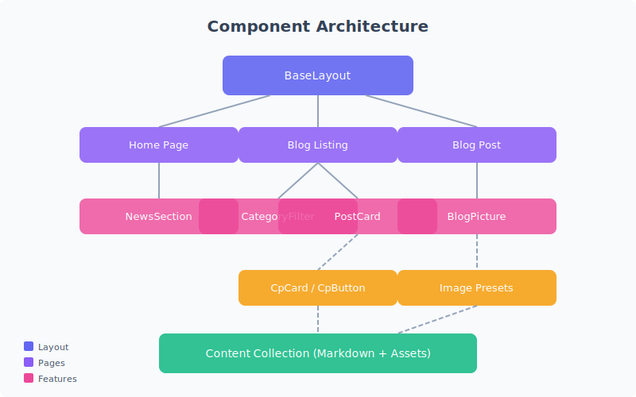

# Contenuti multimediali nel blog

Il blog Prometheus supporta un'ampia gamma di contenuti multimediali incorporati. Questo articolo dimostra ogni tipo e come viene visualizzato nell'area dei contenuti.

## Fotografia raster

Le fotografie standard e le immagini raster vengono automaticamente ottimizzate da Astro — convertite in formati moderni (AVIF, WebP) e servite in diverse dimensioni per il caricamento responsive.

Le immagini raster funzionano bene per fotografie, screenshot e qualsiasi contenuto con gradienti di colore complessi. Astro le elabora durante la build, quindi non c'è overhead a runtime.

## Grafica vettoriale

Le immagini SVG sono ideali per diagrammi, icone e illustrazioni tecniche. Si ridimensionano a qualsiasi formato senza perdere qualità e hanno dimensioni di file minime.

Le immagini vettoriali sono particolarmente utili per:

- **Diagrammi architetturali** — come quello sopra
- **Diagrammi di flusso** e alberi decisionali
- **Icone** e risorse del brand
- **Visualizzazioni dati** e grafici

## Video

Il video incorporato permette tutorial, demo e narrazione visiva. Il player supporta controlli standard — play, pausa, volume, schermo intero.

<video controls preload="metadata" width="100%">
  <source src="./assets/demo.mp4" type="video/mp4" />
  Il tuo browser non supporta l'elemento video.
</video>

I file video vengono serviti come risorse statiche dalla directory `public/`. Per la produzione, considera un CDN o lo streaming adattivo per file più grandi.

## Audio

Gli embed audio sono utili per podcast, campioni musicali o narrazione. Il player nativo del browser fornisce i controlli di riproduzione.

<audio controls preload="metadata">
  <source src="./assets/sample.m4a" type="audio/mp4" />
  Il tuo browser non supporta l'elemento audio.
</audio>

I file audio seguono la stessa strategia di servizio del video — risorse statiche con riproduzione nativa del browser.

## Best practice per i media

Quando aggiungi media agli articoli, tieni a mente queste linee guida:

1. **Immagini**: Posizionale nella cartella `assets/` dell'articolo — Astro le ottimizza automaticamente
2. **Grafica vettoriale**: Usa SVG per diagrammi e illustrazioni
3. **Video**: Mantieni i file piccoli o usa hosting esterno per contenuti più lunghi
4. **Audio**: Fornisci didascalie o trascrizioni per l'accessibilità
5. **Testo alternativo**: Descrivi sempre i contenuti visivi per gli screen reader
